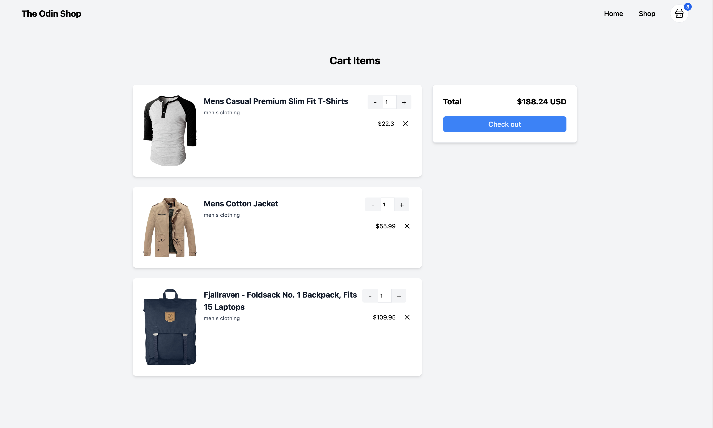

# Shopping cart

A mini project to learn ReactJS, a part of (The Odin Project)[https://www.theodinproject.com] course

[Check out the live version](https://shopping-cart-taupe-three.vercel.app/)

## Running it locally

Make sure Node is installed in your machine and then run `npm install` to install the project's dependencies, followed by `npm run dev` to run it.
